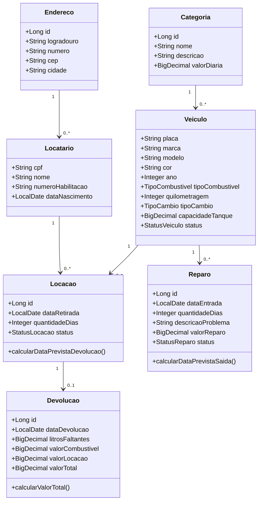
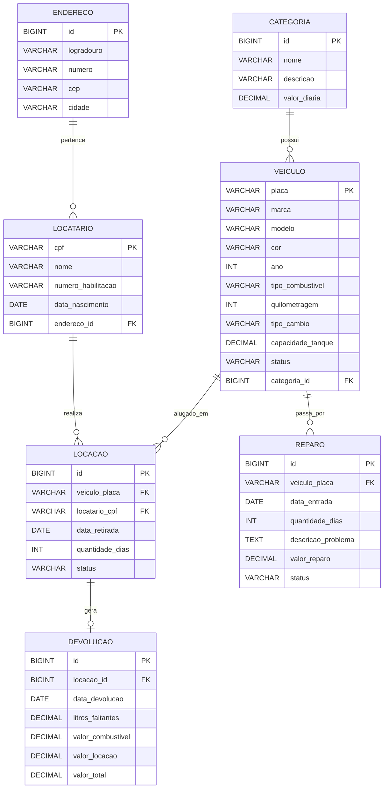

# Documentação Completa — Sistema de Locadora de Veículos em Aeroporto

## 1. Visão Geral do Sistema

O sistema tem como objetivo controlar as operações de uma locadora de veículos localizada em um aeroporto, permitindo que viajantes consultem veículos disponíveis, realizem locações, devolvam veículos, consultem valores de pagamento, cadastrem reparos e gerem relatórios em PDF.

A aplicação será desenvolvida em **Java Web**, obrigatoriamente utilizando:

- **Spring Boot**
- **Spring Web**
- **Spring Data JPA**
- **JSP / JSTL** na camada View
- **SQL Server** como banco de dados relacional
- **JasperReports** para geração dos relatórios PDF
- **Camada View, Model, Controller, Service e Repository** para cada entidade
- **CSS/Bootstrap** para melhorar a usabilidade
- **SQL modularizado**, incluindo consulta com cursor para carros disponíveis

---

## 2. Objetivos do Sistema

### 2.1 Objetivo Geral

Desenvolver uma aplicação web para gerenciar uma locadora de veículos, contemplando cadastro, consulta, locação, devolução, reparos, indisponibilidade de veículos e geração de relatórios em PDF.

### 2.2 Objetivos Específicos

- Cadastrar veículos com suas informações técnicas.
- Cadastrar categorias de veículos e seus respectivos valores de diária.
- Consultar veículos disponíveis por categoria.
- Cadastrar locatários com dados pessoais, habilitação e endereço.
- Registrar locações com data de retirada e quantidade de dias.
- Calcular valor total da locação no momento da devolução.
- Aplicar cobrança extra por combustível faltante.
- Registrar reparos de veículos na oficina da empresa.
- Considerar indisponíveis veículos alugados ou em reparo.
- Gerar relatórios em PDF conforme regras definidas.
- Disponibilizar todas as consultas na camada View e tratar as requisições na camada Controller.

---

## 3. Escopo do Sistema

### 3.1 Funcionalidades Dentro do Escopo

- CRUD de veículos.
- CRUD de categorias.
- CRUD de locatários.
- CRUD de endereços.
- CRUD de locações.
- CRUD de devoluções.
- CRUD de reparos.
- Consulta de veículos disponíveis por categoria.
- Consulta de veículos alugados no dia.
- Consulta de histórico de locações por cliente.
- Consulta de veículos em reparo no dia.
- Relatórios em PDF.
- Uso de UDF com cursor para listagem de veículos disponíveis.

### 3.2 Funcionalidades Fora do Escopo

- Integração com sistemas externos de pagamento.
- Controle financeiro completo da empresa.
- Controle de funcionários.
- Autenticação com níveis de acesso.
- Integração com DETRAN ou validação real de CNH.
- Reserva antecipada sem locação efetiva.

---

## 4. Requisitos Funcionais

### RF01 — Cadastrar Categoria

O sistema deve permitir cadastrar, consultar, editar e excluir categorias de veículos.

Cada categoria deve possuir:

- Identificador
- Nome
- Descrição
- Valor da diária

### RF02 — Cadastrar Veículo

O sistema deve permitir cadastrar, consultar, editar e excluir veículos.

Cada veículo deve possuir:

- Placa
- Marca
- Modelo
- Cor
- Ano
- Tipo de combustível
- Quilometragem
- Tipo de câmbio
- Capacidade total do tanque em litros
- Categoria
- Status

### RF03 — Consultar Veículos Disponíveis por Categoria

O sistema deve permitir consultar todos os veículos disponíveis de uma determinada categoria.

Um veículo será considerado disponível quando:

- Não estiver alugado em uma locação ativa.
- Não estiver em reparo ativo.
- Estiver com status DISPONIVEL.

### RF04 — Cadastrar Locatário

O sistema deve permitir cadastrar, consultar, editar e excluir locatários.

Cada locatário deve possuir:

- CPF
- Nome
- Número da habilitação
- Data de nascimento
- Endereço

### RF05 — Cadastrar Endereço

O sistema deve permitir cadastrar, consultar, editar e excluir endereços.

Cada endereço deve possuir:

- Logradouro
- Número
- CEP
- Cidade

### RF06 — Registrar Locação

O sistema deve permitir registrar uma locação informando:

- Locatário
- Veículo
- Data da retirada
- Quantidade de dias alugados

Ao registrar a locação, o veículo deve ficar indisponível para novas locações.

### RF07 — Registrar Devolução

O sistema deve permitir registrar a devolução de um veículo alugado.

Na devolução devem ser informados:

- Locação
- Data da devolução
- Quantidade de litros faltantes no tanque
- Tipo de combustível cobrado

O sistema deve calcular:

- Valor da diária multiplicado pela quantidade de dias.
- Valor extra por combustível, caso o tanque não esteja cheio.
- Valor total a pagar.

### RF08 — Calcular Valor Extra de Combustível

O sistema deve aplicar as seguintes regras:

- Gasolina: R$ 7,00 por litro faltante.
- Álcool: R$ 5,50 por litro faltante.
- Caso o tanque esteja cheio, não há cobrança extra.

### RF09 — Registrar Reparo

O sistema deve permitir cadastrar, consultar, editar e excluir reparos.

Cada reparo deve possuir:

- Veículo
- Data de entrada
- Quantidade de dias para reparo
- Descrição do problema
- Valor do reparo

Enquanto estiver em reparo, o veículo deve ser considerado indisponível.

### RF10 — Consultar Veículos Alugados no Dia

O sistema deve permitir consultar veículos que estejam alugados em determinado dia.

### RF11 — Relatório PDF de Veículos Alugados no Dia

O sistema deve gerar relatório em PDF contendo:

- Dados do veículo
- Nome do locatário
- CPF do locatário
- Quantidade de dias fora

### RF12 — Relatório PDF de Histórico de Cliente

O sistema deve gerar relatório em PDF contendo:

- Dados do cliente no cabeçalho
- Dados dos veículos alugados
- Dados das locações realizadas

### RF13 — Relatório PDF de Veículos em Reparo no Dia

O sistema deve gerar relatório em PDF contendo:

- Dados do veículo
- Dados do reparo

A consulta deve considerar todos os veículos que estejam em reparo no dia informado, não apenas os que entraram no reparo naquele dia.

### RF14 — CRUD para Cada Entidade

Cada entidade definida no sistema deve possuir:

- Model
- Repository
- Service
- Controller
- View

### RF15 — Disponibilizar Consultas na View

Todas as consultas exigidas devem estar disponíveis em telas web e tratadas por controllers específicos.

---

## 5. Requisitos Não Funcionais

### RNF01 — Tecnologia Obrigatória

A aplicação deve ser desenvolvida em Java Web com Spring Boot, Spring Web e Spring Data JPA.

### RNF02 — Banco de Dados SQL Server

O sistema deve utilizar **Microsoft SQL Server** como banco relacional, com tabelas normalizadas, relacionamentos bem definidos, chaves primárias, chaves estrangeiras, constraints, views, procedures e funções quando necessário.

### RNF03 — Usabilidade

As páginas devem ser responsivas, organizadas e de fácil navegação, utilizando CSS ou Bootstrap.

### RNF04 — Manutenibilidade

O código deve ser modularizado, com separação clara entre Controller, Service, Repository, Model e View.

### RNF05 — Boas Práticas

O desenvolvimento deve aplicar princípios SOLID, boas práticas de orientação a objetos e comentários explicativos no código.

### RNF06 — Segurança Básica de Dados

Campos como CPF, placa e número da habilitação devem possuir validação de formato e restrições de unicidade.

### RNF07 — Relatórios

Os relatórios devem ser gerados em formato PDF utilizando **JasperReports** e disponibilizados para download pela camada Controller.

### RNF08 — Integridade Referencial

O banco deve impedir registros órfãos por meio de chaves estrangeiras.

### RNF09 — Disponibilidade Correta dos Veículos

O sistema não deve permitir locar veículo que esteja alugado ou em reparo.

### RNF10 — SQL Modularizado

As consultas complexas devem ser separadas em funções, views ou procedures, evitando SQL repetido no código Java.

---

## 6. Regras de Negócio

### RN01 — Identificação do Veículo

Todo veículo deve ser identificado de forma única pela placa.

### RN02 — Valor da Diária

O valor da diária não pertence diretamente ao veículo, mas sim à categoria do veículo.

### RN03 — Disponibilidade do Veículo

Um veículo é indisponível quando:

- Está alugado em uma locação ativa.
- Está em reparo ativo.
- Possui status diferente de DISPONIVEL.

### RN04 — Locação Apenas para Veículo Disponível

O sistema não deve permitir registrar locação de veículo indisponível.

### RN05 — Locação Apenas para Locatário Cadastrado

Uma locação só pode ser registrada para um locatário previamente cadastrado.

### RN06 — Devolução com Tanque Cheio

Todo veículo deve ser devolvido com tanque cheio. Caso contrário, o sistema deve cobrar o valor correspondente aos litros faltantes.

### RN07 — Cálculo da Locação

O valor base da locação é:

```text
valorBase = quantidadeDias * valorDiariaCategoria
```

### RN08 — Cálculo do Combustível Faltante

```text
valorCombustivel = litrosFaltantes * valorPorLitro
```

Onde:

- Gasolina = R$ 7,00 por litro.
- Álcool = R$ 5,50 por litro.

### RN09 — Cálculo Total da Devolução

```text
valorTotal = valorBase + valorCombustivel
```

### RN10 — Encerramento da Locação

Após a devolução, a locação deve ser marcada como FINALIZADA.

### RN11 — Entrada em Reparo

Quando um veículo apresentar defeito, deve ser cadastrado um reparo.

### RN12 — Período de Reparo

Um veículo estará em reparo do dia de entrada até:

```text
dataEntrada + quantidadeDiasReparo
```

### RN13 — Relatório de Reparo no Dia

O relatório de reparo deve considerar reparos ativos na data pesquisada, mesmo que tenham iniciado antes dessa data.

### RN14 — Exclusão de Registros

Registros vinculados a locações ou reparos não devem ser excluídos fisicamente. Recomenda-se exclusão lógica ou bloqueio da exclusão.

---

## 7. Entidades do Sistema

## 7.1 Categoria

Representa a categoria do veículo e define o valor da diária.

### Atributos

| Campo | Tipo | Obrigatório | Observação |
|---|---:|---:|---|
| id | Long | Sim | Chave primária |
| nome | String | Sim | Ex: Econômico, SUV, Luxo |
| descricao | String | Não | Descrição da categoria |
| valorDiaria | BigDecimal | Sim | Valor cobrado por dia |

---

## 7.2 Veiculo

Representa um automóvel da locadora.

### Atributos

| Campo | Tipo | Obrigatório | Observação |
|---|---:|---:|---|
| placa | String | Sim | Chave primária |
| marca | String | Sim | Marca do carro |
| modelo | String | Sim | Modelo do carro |
| cor | String | Sim | Cor do carro |
| ano | Integer | Sim | Ano de fabricação/modelo |
| tipoCombustivel | Enum | Sim | GASOLINA ou ALCOOL |
| quilometragem | Integer | Sim | Km rodados |
| tipoCambio | Enum | Sim | MANUAL ou AUTOMATICO |
| capacidadeTanque | BigDecimal | Sim | Capacidade em litros |
| status | Enum | Sim | DISPONIVEL, ALUGADO, EM_REPARO, INATIVO |
| categoria | Categoria | Sim | Relacionamento N:1 |

---

## 7.3 Locatario

Representa o cliente que aluga veículos.

### Atributos

| Campo | Tipo | Obrigatório | Observação |
|---|---:|---:|---|
| cpf | String | Sim | Chave primária |
| nome | String | Sim | Nome completo |
| numeroHabilitacao | String | Sim | Deve ser único |
| dataNascimento | LocalDate | Sim | Data de nascimento |
| endereco | Endereco | Sim | Relacionamento N:1 ou 1:1 |

---

## 7.4 Endereco

Representa o endereço do locatário.

### Atributos

| Campo | Tipo | Obrigatório | Observação |
|---|---:|---:|---|
| id | Long | Sim | Chave primária |
| logradouro | String | Sim | Rua, avenida etc. |
| numero | String | Sim | Número do imóvel |
| cep | String | Sim | CEP |
| cidade | String | Sim | Cidade |

---

## 7.5 Locacao

Representa o aluguel de um veículo.

### Atributos

| Campo | Tipo | Obrigatório | Observação |
|---|---:|---:|---|
| id | Long | Sim | Chave primária |
| veiculo | Veiculo | Sim | Relacionamento N:1 |
| locatario | Locatario | Sim | Relacionamento N:1 |
| dataRetirada | LocalDate | Sim | Data de início |
| quantidadeDias | Integer | Sim | Dias alugados |
| status | Enum | Sim | ATIVA ou FINALIZADA |

### Campo Derivado

```text
dataPrevistaDevolucao = dataRetirada + quantidadeDias
```

---

## 7.6 Devolucao

Representa a devolução de uma locação.

### Atributos

| Campo | Tipo | Obrigatório | Observação |
|---|---:|---:|---|
| id | Long | Sim | Chave primária |
| locacao | Locacao | Sim | Relacionamento 1:1 |
| dataDevolucao | LocalDate | Sim | Data real da devolução |
| litrosFaltantes | BigDecimal | Sim | Litros faltantes no tanque |
| valorCombustivel | BigDecimal | Sim | Valor extra calculado |
| valorLocacao | BigDecimal | Sim | Valor pelos dias alugados |
| valorTotal | BigDecimal | Sim | Valor final |

---

## 7.7 Reparo

Representa a manutenção de um veículo na oficina da empresa.

### Atributos

| Campo | Tipo | Obrigatório | Observação |
|---|---:|---:|---|
| id | Long | Sim | Chave primária |
| veiculo | Veiculo | Sim | Relacionamento N:1 |
| dataEntrada | LocalDate | Sim | Data de entrada na oficina |
| quantidadeDias | Integer | Sim | Tempo previsto de reparo |
| descricaoProblema | String | Sim | Problema identificado |
| valorReparo | BigDecimal | Sim | Valor do reparo |
| status | Enum | Sim | EM_ANDAMENTO ou FINALIZADO |

### Campo Derivado

```text
dataPrevistaSaida = dataEntrada + quantidadeDias
```

---

## 8. Enums Recomendados

### TipoCombustivel

```java
public enum TipoCombustivel {
    GASOLINA,
    ALCOOL
}
```

### TipoCambio

```java
public enum TipoCambio {
    MANUAL,
    AUTOMATICO
}
```

### StatusVeiculo

```java
public enum StatusVeiculo {
    DISPONIVEL,
    ALUGADO,
    EM_REPARO,
    INATIVO
}
```

### StatusLocacao

```java
public enum StatusLocacao {
    ATIVA,
    FINALIZADA
}
```

### StatusReparo

```java
public enum StatusReparo {
    EM_ANDAMENTO,
    FINALIZADO
}
```

---

# 9. Diagrama de Classes em Mermaid



---

# 10. Diagrama Entidade-Relacionamento ER em Mermaid



---

# 11. Modelo Relacional — SQL Server

## 11.1 Tabela categoria

```sql
CREATE TABLE categoria (
    id BIGINT IDENTITY(1,1) PRIMARY KEY,
    nome VARCHAR(80) NOT NULL UNIQUE,
    descricao VARCHAR(255) NULL,
    valor_diaria DECIMAL(10,2) NOT NULL,
    CONSTRAINT chk_categoria_valor_diaria CHECK (valor_diaria > 0)
);
```

## 11.2 Tabela veiculo

```sql
CREATE TABLE veiculo (
    placa VARCHAR(10) PRIMARY KEY,
    marca VARCHAR(80) NOT NULL,
    modelo VARCHAR(80) NOT NULL,
    cor VARCHAR(40) NOT NULL,
    ano INT NOT NULL,
    tipo_combustivel VARCHAR(20) NOT NULL,
    quilometragem INT NOT NULL,
    tipo_cambio VARCHAR(20) NOT NULL,
    capacidade_tanque DECIMAL(6,2) NOT NULL,
    status VARCHAR(20) NOT NULL,
    categoria_id BIGINT NOT NULL,

    CONSTRAINT fk_veiculo_categoria
        FOREIGN KEY (categoria_id) REFERENCES categoria(id),

    CONSTRAINT chk_veiculo_ano
        CHECK (ano >= 1980),

    CONSTRAINT chk_veiculo_tipo_combustivel
        CHECK (tipo_combustivel IN ('GASOLINA', 'ALCOOL')),

    CONSTRAINT chk_veiculo_quilometragem
        CHECK (quilometragem >= 0),

    CONSTRAINT chk_veiculo_tipo_cambio
        CHECK (tipo_cambio IN ('MANUAL', 'AUTOMATICO')),

    CONSTRAINT chk_veiculo_capacidade_tanque
        CHECK (capacidade_tanque > 0),

    CONSTRAINT chk_veiculo_status
        CHECK (status IN ('DISPONIVEL', 'ALUGADO', 'EM_REPARO', 'INATIVO'))
);
```

## 11.3 Tabela endereco

```sql
CREATE TABLE endereco (
    id BIGINT IDENTITY(1,1) PRIMARY KEY,
    logradouro VARCHAR(120) NOT NULL,
    numero VARCHAR(20) NOT NULL,
    cep VARCHAR(10) NOT NULL,
    cidade VARCHAR(80) NOT NULL
);
```

## 11.4 Tabela locatario

```sql
CREATE TABLE locatario (
    cpf VARCHAR(14) PRIMARY KEY,
    nome VARCHAR(120) NOT NULL,
    numero_habilitacao VARCHAR(30) NOT NULL UNIQUE,
    data_nascimento DATE NOT NULL,
    endereco_id BIGINT NOT NULL,

    CONSTRAINT fk_locatario_endereco
        FOREIGN KEY (endereco_id) REFERENCES endereco(id)
);
```

## 11.5 Tabela locacao

```sql
CREATE TABLE locacao (
    id BIGINT IDENTITY(1,1) PRIMARY KEY,
    veiculo_placa VARCHAR(10) NOT NULL,
    locatario_cpf VARCHAR(14) NOT NULL,
    data_retirada DATE NOT NULL,
    quantidade_dias INT NOT NULL,
    status VARCHAR(20) NOT NULL,

    CONSTRAINT fk_locacao_veiculo
        FOREIGN KEY (veiculo_placa) REFERENCES veiculo(placa),

    CONSTRAINT fk_locacao_locatario
        FOREIGN KEY (locatario_cpf) REFERENCES locatario(cpf),

    CONSTRAINT chk_locacao_quantidade_dias
        CHECK (quantidade_dias > 0),

    CONSTRAINT chk_locacao_status
        CHECK (status IN ('ATIVA', 'FINALIZADA'))
);
```

## 11.6 Tabela devolucao

```sql
CREATE TABLE devolucao (
    id BIGINT IDENTITY(1,1) PRIMARY KEY,
    locacao_id BIGINT NOT NULL UNIQUE,
    data_devolucao DATE NOT NULL,
    litros_faltantes DECIMAL(6,2) NOT NULL,
    valor_combustivel DECIMAL(10,2) NOT NULL,
    valor_locacao DECIMAL(10,2) NOT NULL,
    valor_total DECIMAL(10,2) NOT NULL,

    CONSTRAINT fk_devolucao_locacao
        FOREIGN KEY (locacao_id) REFERENCES locacao(id),

    CONSTRAINT chk_devolucao_litros_faltantes
        CHECK (litros_faltantes >= 0),

    CONSTRAINT chk_devolucao_valor_combustivel
        CHECK (valor_combustivel >= 0),

    CONSTRAINT chk_devolucao_valor_locacao
        CHECK (valor_locacao >= 0),

    CONSTRAINT chk_devolucao_valor_total
        CHECK (valor_total >= 0)
);
```

## 11.7 Tabela reparo

```sql
CREATE TABLE reparo (
    id BIGINT IDENTITY(1,1) PRIMARY KEY,
    veiculo_placa VARCHAR(10) NOT NULL,
    data_entrada DATE NOT NULL,
    quantidade_dias INT NOT NULL,
    descricao_problema VARCHAR(MAX) NOT NULL,
    valor_reparo DECIMAL(10,2) NOT NULL,
    status VARCHAR(20) NOT NULL,

    CONSTRAINT fk_reparo_veiculo
        FOREIGN KEY (veiculo_placa) REFERENCES veiculo(placa),

    CONSTRAINT chk_reparo_quantidade_dias
        CHECK (quantidade_dias > 0),

    CONSTRAINT chk_reparo_valor_reparo
        CHECK (valor_reparo >= 0),

    CONSTRAINT chk_reparo_status
        CHECK (status IN ('EM_ANDAMENTO', 'FINALIZADO'))
);
```

---

# 12. SQL Modularizado — SQL Server

## 12.1 View de Locações Ativas

```sql
CREATE OR ALTER VIEW vw_locacoes_ativas AS
SELECT
    l.id,
    l.veiculo_placa,
    l.locatario_cpf,
    l.data_retirada,
    l.quantidade_dias,
    DATEADD(DAY, l.quantidade_dias, l.data_retirada) AS data_prevista_devolucao,
    l.status
FROM locacao l
WHERE l.status = 'ATIVA';
GO
```

## 12.2 View de Reparos Ativos

```sql
CREATE OR ALTER VIEW vw_reparos_ativos AS
SELECT
    r.id,
    r.veiculo_placa,
    r.data_entrada,
    r.quantidade_dias,
    DATEADD(DAY, r.quantidade_dias, r.data_entrada) AS data_prevista_saida,
    r.descricao_problema,
    r.valor_reparo,
    r.status
FROM reparo r
WHERE r.status = 'EM_ANDAMENTO';
GO
```

## 12.3 Procedure com Cursor para Listar Carros Disponíveis

No SQL Server, uma UDF não pode retornar um cursor para ser consumido externamente da mesma forma que uma procedure. Para atender à exigência acadêmica de uso de cursor, recomenda-se implementar uma **stored procedure com cursor** para listar os carros disponíveis. Como complemento, a seção seguinte apresenta uma **table-valued function**, que é mais adequada para consumo pelo Spring Data JPA.

```sql
CREATE OR ALTER PROCEDURE sp_carros_disponiveis_cursor
    @categoria_id BIGINT
AS
BEGIN
    SET NOCOUNT ON;

    DECLARE
        @placa VARCHAR(10),
        @marca VARCHAR(80),
        @modelo VARCHAR(80),
        @cor VARCHAR(40),
        @ano INT,
        @tipo_combustivel VARCHAR(20),
        @quilometragem INT,
        @tipo_cambio VARCHAR(20),
        @capacidade_tanque DECIMAL(6,2),
        @categoria VARCHAR(80),
        @valor_diaria DECIMAL(10,2);

    DECLARE carros_cursor CURSOR FOR
        SELECT
            v.placa,
            v.marca,
            v.modelo,
            v.cor,
            v.ano,
            v.tipo_combustivel,
            v.quilometragem,
            v.tipo_cambio,
            v.capacidade_tanque,
            c.nome,
            c.valor_diaria
        FROM veiculo v
        INNER JOIN categoria c ON c.id = v.categoria_id
        WHERE v.categoria_id = @categoria_id
          AND v.status = 'DISPONIVEL'
          AND NOT EXISTS (
              SELECT 1
              FROM locacao l
              WHERE l.veiculo_placa = v.placa
                AND l.status = 'ATIVA'
          )
          AND NOT EXISTS (
              SELECT 1
              FROM reparo r
              WHERE r.veiculo_placa = v.placa
                AND r.status = 'EM_ANDAMENTO'
          )
        ORDER BY v.marca, v.modelo;

    CREATE TABLE #carros_disponiveis (
        placa VARCHAR(10),
        marca VARCHAR(80),
        modelo VARCHAR(80),
        cor VARCHAR(40),
        ano INT,
        tipo_combustivel VARCHAR(20),
        quilometragem INT,
        tipo_cambio VARCHAR(20),
        capacidade_tanque DECIMAL(6,2),
        categoria VARCHAR(80),
        valor_diaria DECIMAL(10,2)
    );

    OPEN carros_cursor;

    FETCH NEXT FROM carros_cursor INTO
        @placa, @marca, @modelo, @cor, @ano,
        @tipo_combustivel, @quilometragem, @tipo_cambio,
        @capacidade_tanque, @categoria, @valor_diaria;

    WHILE @@FETCH_STATUS = 0
    BEGIN
        INSERT INTO #carros_disponiveis VALUES (
            @placa, @marca, @modelo, @cor, @ano,
            @tipo_combustivel, @quilometragem, @tipo_cambio,
            @capacidade_tanque, @categoria, @valor_diaria
        );

        FETCH NEXT FROM carros_cursor INTO
            @placa, @marca, @modelo, @cor, @ano,
            @tipo_combustivel, @quilometragem, @tipo_cambio,
            @capacidade_tanque, @categoria, @valor_diaria;
    END;

    CLOSE carros_cursor;
    DEALLOCATE carros_cursor;

    SELECT * FROM #carros_disponiveis;
END;
GO
```

## 12.4 UDF Table-Valued para Listar Carros Disponíveis

```sql
CREATE OR ALTER FUNCTION fn_carros_disponiveis(@categoria_id BIGINT)
RETURNS TABLE
AS
RETURN
(
    SELECT
        v.placa,
        v.marca,
        v.modelo,
        v.cor,
        v.ano,
        v.tipo_combustivel,
        v.quilometragem,
        v.tipo_cambio,
        v.capacidade_tanque,
        c.nome AS categoria,
        c.valor_diaria
    FROM veiculo v
    INNER JOIN categoria c ON c.id = v.categoria_id
    WHERE v.categoria_id = @categoria_id
      AND v.status = 'DISPONIVEL'
      AND NOT EXISTS (
          SELECT 1
          FROM locacao l
          WHERE l.veiculo_placa = v.placa
            AND l.status = 'ATIVA'
      )
      AND NOT EXISTS (
          SELECT 1
          FROM reparo r
          WHERE r.veiculo_placa = v.placa
            AND r.status = 'EM_ANDAMENTO'
      )
);
GO
```

## 12.5 Função para Reparos Ativos em uma Data

```sql
CREATE OR ALTER FUNCTION fn_reparos_no_dia(@data DATE)
RETURNS TABLE
AS
RETURN
(
    SELECT
        r.id AS reparo_id,
        v.placa,
        v.marca,
        v.modelo,
        v.cor,
        v.ano,
        r.data_entrada,
        r.quantidade_dias,
        DATEADD(DAY, r.quantidade_dias, r.data_entrada) AS data_prevista_saida,
        r.descricao_problema,
        r.valor_reparo
    FROM reparo r
    INNER JOIN veiculo v ON v.placa = r.veiculo_placa
    WHERE r.status = 'EM_ANDAMENTO'
      AND @data BETWEEN r.data_entrada AND DATEADD(DAY, r.quantidade_dias, r.data_entrada)
);
GO
```

## 12.6 Função para Veículos Alugados no Dia

```sql
CREATE OR ALTER FUNCTION fn_veiculos_alugados_no_dia(@data DATE)
RETURNS TABLE
AS
RETURN
(
    SELECT
        l.id AS locacao_id,
        v.placa,
        v.marca,
        v.modelo,
        v.cor,
        v.ano,
        lo.cpf,
        lo.nome,
        l.quantidade_dias,
        l.data_retirada,
        DATEADD(DAY, l.quantidade_dias, l.data_retirada) AS data_prevista_devolucao
    FROM locacao l
    INNER JOIN veiculo v ON v.placa = l.veiculo_placa
    INNER JOIN locatario lo ON lo.cpf = l.locatario_cpf
    WHERE l.status = 'ATIVA'
      AND @data BETWEEN l.data_retirada AND DATEADD(DAY, l.quantidade_dias, l.data_retirada)
);
GO
```

---

# 13. Arquitetura da Aplicação Spring Boot

## 13.1 Pacotes Recomendados

```text
br.com.locadora
├── LocadoraApplication.java
├── controller
│   ├── CategoriaController.java
│   ├── VeiculoController.java
│   ├── LocatarioController.java
│   ├── EnderecoController.java
│   ├── LocacaoController.java
│   ├── DevolucaoController.java
│   ├── ReparoController.java
│   └── RelatorioController.java
├── model
│   ├── Categoria.java
│   ├── Veiculo.java
│   ├── Locatario.java
│   ├── Endereco.java
│   ├── Locacao.java
│   ├── Devolucao.java
│   ├── Reparo.java
│   └── enums
├── repository
│   ├── CategoriaRepository.java
│   ├── VeiculoRepository.java
│   ├── LocatarioRepository.java
│   ├── EnderecoRepository.java
│   ├── LocacaoRepository.java
│   ├── DevolucaoRepository.java
│   └── ReparoRepository.java
├── service
│   ├── CategoriaService.java
│   ├── VeiculoService.java
│   ├── LocatarioService.java
│   ├── LocacaoService.java
│   ├── DevolucaoService.java
│   ├── ReparoService.java
│   └── RelatorioService.java
├── dto
│   ├── VeiculoDisponivelDTO.java
│   ├── VeiculoAlugadoDiaDTO.java
│   ├── HistoricoClienteDTO.java
│   └── ReparoDiaDTO.java
└── exception
    ├── RegraNegocioException.java
    └── RecursoNaoEncontradoException.java
```

---

# 14. Camadas da Aplicação

## 14.1 Model

Responsável por representar as entidades do domínio e o mapeamento JPA.

Exemplo:

```java
@Entity
@Table(name = "veiculo")
public class Veiculo {

    @Id
    private String placa;

    @Column(nullable = false)
    private String marca;

    @Column(nullable = false)
    private String modelo;

    @Column(nullable = false)
    private String cor;

    @Column(nullable = false)
    private Integer ano;

    @Enumerated(EnumType.STRING)
    @Column(nullable = false)
    private TipoCombustivel tipoCombustivel;

    @Column(nullable = false)
    private Integer quilometragem;

    @Enumerated(EnumType.STRING)
    @Column(nullable = false)
    private TipoCambio tipoCambio;

    @Column(nullable = false)
    private BigDecimal capacidadeTanque;

    @Enumerated(EnumType.STRING)
    @Column(nullable = false)
    private StatusVeiculo status;

    @ManyToOne(optional = false)
    @JoinColumn(name = "categoria_id")
    private Categoria categoria;
}
```

## 14.2 Repository

Responsável pelo acesso aos dados.

```java
@Repository
public interface VeiculoRepository extends JpaRepository<Veiculo, String> {

    List<Veiculo> findByCategoriaIdAndStatus(Long categoriaId, StatusVeiculo status);

    @Query(value = "SELECT * FROM fn_veiculos_alugados_no_dia(:data)", nativeQuery = true)
    List<Object[]> buscarVeiculosAlugadosNoDia(@Param("data") LocalDate data);
}
```

## 14.3 Service

Responsável pelas regras de negócio.

```java
@Service
public class LocacaoService {

    private final LocacaoRepository locacaoRepository;
    private final VeiculoRepository veiculoRepository;

    public LocacaoService(LocacaoRepository locacaoRepository, VeiculoRepository veiculoRepository) {
        this.locacaoRepository = locacaoRepository;
        this.veiculoRepository = veiculoRepository;
    }

    /**
     * SOLID - Single Responsibility Principle:
     * Esta classe concentra somente regras relacionadas à locação.
     * A persistência fica no Repository e a navegação HTTP no Controller.
     */
    public Locacao registrarLocacao(Locacao locacao) {
        Veiculo veiculo = veiculoRepository.findById(locacao.getVeiculo().getPlaca())
                .orElseThrow(() -> new RegraNegocioException("Veículo não encontrado."));

        if (veiculo.getStatus() != StatusVeiculo.DISPONIVEL) {
            throw new RegraNegocioException("Veículo indisponível para locação.");
        }

        locacao.setStatus(StatusLocacao.ATIVA);
        veiculo.setStatus(StatusVeiculo.ALUGADO);

        veiculoRepository.save(veiculo);
        return locacaoRepository.save(locacao);
    }
}
```

## 14.4 Controller

Responsável por receber requisições da View, acionar os Services e retornar páginas HTML ou arquivos PDF.

```java
@Controller
@RequestMapping("/locacoes")
public class LocacaoController {

    private final LocacaoService locacaoService;

    public LocacaoController(LocacaoService locacaoService) {
        this.locacaoService = locacaoService;
    }

    @GetMapping("/nova")
    public String formulario(Model model) {
        model.addAttribute("locacao", new Locacao());
        return "locacoes/form";
    }

    @PostMapping
    public String salvar(@ModelAttribute Locacao locacao, RedirectAttributes attributes) {
        locacaoService.registrarLocacao(locacao);
        attributes.addFlashAttribute("mensagem", "Locação registrada com sucesso.");
        return "redirect:/locacoes";
    }
}
```

## 14.5 View com JSP/JSTL

Responsável pela interface do usuário. A aplicação deve utilizar **JSP** com **JSTL** e pode utilizar **Bootstrap** para o layout responsivo.

No Spring Boot, as páginas JSP devem ficar em:

```text
src/main/webapp/WEB-INF/jsp
```

Exemplo de configuração no `application.properties`:

```properties
spring.mvc.view.prefix=/WEB-INF/jsp/
spring.mvc.view.suffix=.jsp
```

Exemplo de tela JSP para consulta de veículos disponíveis:

```jsp
<%@ page contentType="text/html;charset=UTF-8" language="java" %>
<%@ taglib prefix="c" uri="http://java.sun.com/jsp/jstl/core" %>

<html>
<head>
    <title>Veículos Disponíveis</title>
    <link rel="stylesheet"
          href="https://cdn.jsdelivr.net/npm/bootstrap@5.3.3/dist/css/bootstrap.min.css">
</head>
<body class="container mt-4">

<h1>Consultar Veículos Disponíveis</h1>

<form method="get" action="${pageContext.request.contextPath}/veiculos/disponiveis">
    <div class="mb-3">
        <label class="form-label">Categoria</label>
        <select name="categoriaId" class="form-select">
            <c:forEach var="categoria" items="${categorias}">
                <option value="${categoria.id}">${categoria.nome}</option>
            </c:forEach>
        </select>
    </div>

    <button type="submit" class="btn btn-primary">Consultar</button>
</form>

<c:if test="${not empty veiculos}">
    <table class="table table-striped mt-4">
        <thead>
        <tr>
            <th>Placa</th>
            <th>Marca</th>
            <th>Modelo</th>
            <th>Cor</th>
            <th>Ano</th>
            <th>Diária</th>
            <th>Ação</th>
        </tr>
        </thead>
        <tbody>
        <c:forEach var="veiculo" items="${veiculos}">
            <tr>
                <td>${veiculo.placa}</td>
                <td>${veiculo.marca}</td>
                <td>${veiculo.modelo}</td>
                <td>${veiculo.cor}</td>
                <td>${veiculo.ano}</td>
                <td>${veiculo.valorDiaria}</td>
                <td>
                    <a class="btn btn-success btn-sm"
                       href="${pageContext.request.contextPath}/locacoes/nova?placa=${veiculo.placa}">
                        Alugar
                    </a>
                </td>
            </tr>
        </c:forEach>
        </tbody>
    </table>
</c:if>

</body>
</html>
```

---

# 15. CRUDs Obrigatórios

Cada entidade deve possuir as seguintes rotas básicas:

## 15.1 Categoria

| Método | Rota | Descrição |
|---|---|---|
| GET | /categorias | Lista categorias |
| GET | /categorias/nova | Formulário de cadastro |
| POST | /categorias | Salva categoria |
| GET | /categorias/editar/{id} | Formulário de edição |
| POST | /categorias/editar/{id} | Atualiza categoria |
| GET | /categorias/excluir/{id} | Exclui categoria |

## 15.2 Veículo

| Método | Rota | Descrição |
|---|---|---|
| GET | /veiculos | Lista veículos |
| GET | /veiculos/novo | Formulário de cadastro |
| POST | /veiculos | Salva veículo |
| GET | /veiculos/editar/{placa} | Formulário de edição |
| POST | /veiculos/editar/{placa} | Atualiza veículo |
| GET | /veiculos/excluir/{placa} | Exclui veículo |
| GET | /veiculos/disponiveis | Consulta disponíveis por categoria |

## 15.3 Locatário

| Método | Rota | Descrição |
|---|---|---|
| GET | /locatarios | Lista locatários |
| GET | /locatarios/novo | Formulário de cadastro |
| POST | /locatarios | Salva locatário |
| GET | /locatarios/editar/{cpf} | Formulário de edição |
| POST | /locatarios/editar/{cpf} | Atualiza locatário |
| GET | /locatarios/excluir/{cpf} | Exclui locatário |
| GET | /locatarios/{cpf}/historico | Histórico de locações |

## 15.4 Locação

| Método | Rota | Descrição |
|---|---|---|
| GET | /locacoes | Lista locações |
| GET | /locacoes/nova | Formulário de cadastro |
| POST | /locacoes | Salva locação |
| GET | /locacoes/editar/{id} | Formulário de edição |
| POST | /locacoes/editar/{id} | Atualiza locação |
| GET | /locacoes/excluir/{id} | Exclui locação |
| GET | /locacoes/alugados-dia | Consulta alugados no dia |

## 15.5 Devolução

| Método | Rota | Descrição |
|---|---|---|
| GET | /devolucoes | Lista devoluções |
| GET | /devolucoes/nova/{locacaoId} | Formulário de devolução |
| POST | /devolucoes | Registra devolução |
| GET | /devolucoes/{id} | Detalha devolução |

## 15.6 Reparo

| Método | Rota | Descrição |
|---|---|---|
| GET | /reparos | Lista reparos |
| GET | /reparos/novo | Formulário de cadastro |
| POST | /reparos | Salva reparo |
| GET | /reparos/editar/{id} | Formulário de edição |
| POST | /reparos/editar/{id} | Atualiza reparo |
| GET | /reparos/excluir/{id} | Exclui reparo |
| GET | /reparos/no-dia | Consulta reparos no dia |

---

# 16. Consultas e Relatórios PDF

## 16.1 Relatório de Veículos Alugados no Dia

### Rota

```text
GET /relatorios/veiculos-alugados-dia?data=2026-05-18
```

### Dados exibidos

- Placa
- Marca
- Modelo
- Cor
- Ano
- Nome do locatário
- CPF do locatário
- Data de retirada
- Quantidade de dias fora
- Data prevista de devolução

## 16.2 Relatório de Histórico de Cliente

### Rota

```text
GET /relatorios/historico-cliente/{cpf}
```

### Cabeçalho

- Nome do cliente
- CPF
- Número da habilitação
- Data de nascimento
- Endereço

### Corpo

- Dados dos veículos alugados
- Dados da locação
- Data da devolução, se houver
- Valor total pago, se houver

## 16.3 Relatório de Veículos em Reparo no Dia

### Rota

```text
GET /relatorios/reparos-dia?data=2026-05-18
```

### Dados exibidos

- Placa
- Marca
- Modelo
- Cor
- Ano
- Data de entrada
- Quantidade de dias para reparo
- Data prevista de saída
- Descrição do problema
- Valor do reparo

---

# 17. Geração de PDF com JasperReports

Os relatórios devem ser implementados utilizando **JasperReports**. Os layouts devem ser criados em arquivos `.jrxml`, compilados em tempo de execução ou previamente compilados como `.jasper`.

## 17.1 Estrutura dos Arquivos de Relatório

```text
src/main/resources/reports
├── veiculos-alugados-dia.jrxml
├── historico-cliente.jrxml
└── reparos-dia.jrxml
```

## 17.2 Dependência Maven

```xml
<dependency>
    <groupId>net.sf.jasperreports</groupId>
    <artifactId>jasperreports</artifactId>
    <version>6.21.3</version>
</dependency>
```

## 17.3 Service de Relatório

```java
@Service
public class RelatorioService {

    private final DataSource dataSource;

    public RelatorioService(DataSource dataSource) {
        this.dataSource = dataSource;
    }

    /**
     * SOLID - SRP:
     * Esta classe é responsável somente pela geração de relatórios.
     * As regras de locação, devolução e reparo ficam em seus próprios services.
     */
    public byte[] gerarVeiculosAlugadosNoDia(LocalDate data) {
        try (Connection connection = dataSource.getConnection()) {
            InputStream arquivo = getClass()
                    .getResourceAsStream("/reports/veiculos-alugados-dia.jrxml");

            JasperReport jasperReport = JasperCompileManager.compileReport(arquivo);

            Map<String, Object> parametros = new HashMap<>();
            parametros.put("DATA_CONSULTA", java.sql.Date.valueOf(data));

            JasperPrint jasperPrint = JasperFillManager.fillReport(
                    jasperReport,
                    parametros,
                    connection
            );

            return JasperExportManager.exportReportToPdf(jasperPrint);
        } catch (Exception e) {
            throw new RegraNegocioException("Erro ao gerar relatório PDF.");
        }
    }
}
```

## 17.4 Controller de Relatório

```java
@Controller
@RequestMapping("/relatorios")
public class RelatorioController {

    private final RelatorioService relatorioService;

    public RelatorioController(RelatorioService relatorioService) {
        this.relatorioService = relatorioService;
    }

    @GetMapping("/veiculos-alugados-dia")
    public ResponseEntity<byte[]> veiculosAlugadosNoDia(@RequestParam LocalDate data) {
        byte[] pdf = relatorioService.gerarVeiculosAlugadosNoDia(data);

        return ResponseEntity.ok()
                .header(HttpHeaders.CONTENT_DISPOSITION,
                        "attachment; filename=veiculos-alugados-dia.pdf")
                .contentType(MediaType.APPLICATION_PDF)
                .body(pdf);
    }
}
```

## 17.5 Consultas nos Arquivos JRXML

Consulta para veículos alugados no dia:

```sql
SELECT *
FROM dbo.fn_veiculos_alugados_no_dia($P{DATA_CONSULTA})
```

Consulta para histórico do cliente:

```sql
SELECT
    lo.cpf,
    lo.nome,
    lo.numero_habilitacao,
    lo.data_nascimento,
    e.logradouro,
    e.numero,
    e.cep,
    e.cidade,
    v.placa,
    v.marca,
    v.modelo,
    l.data_retirada,
    l.quantidade_dias,
    l.status,
    d.data_devolucao,
    d.valor_total
FROM locatario lo
INNER JOIN endereco e ON e.id = lo.endereco_id
INNER JOIN locacao l ON l.locatario_cpf = lo.cpf
INNER JOIN veiculo v ON v.placa = l.veiculo_placa
LEFT JOIN devolucao d ON d.locacao_id = l.id
WHERE lo.cpf = $P{CPF_CLIENTE}
ORDER BY l.data_retirada DESC
```

Consulta para reparos no dia:

```sql
SELECT *
FROM dbo.fn_reparos_no_dia($P{DATA_CONSULTA})
```

---

# 18. Regras de Cálculo da Devolução

```java
@Service
public class DevolucaoService {

    private static final BigDecimal VALOR_LITRO_GASOLINA = new BigDecimal("7.00");
    private static final BigDecimal VALOR_LITRO_ALCOOL = new BigDecimal("5.50");

    /**
     * SOLID - Single Responsibility Principle:
     * Este método calcula apenas os valores da devolução.
     * A geração de PDF, a interface e a persistência ficam em outras classes.
     */
    public Devolucao registrarDevolucao(Locacao locacao, BigDecimal litrosFaltantes, LocalDate dataDevolucao) {
        BigDecimal valorDiaria = locacao.getVeiculo().getCategoria().getValorDiaria();
        BigDecimal valorLocacao = valorDiaria.multiply(BigDecimal.valueOf(locacao.getQuantidadeDias()));

        BigDecimal valorLitro = obterValorLitro(locacao.getVeiculo().getTipoCombustivel());
        BigDecimal valorCombustivel = litrosFaltantes.multiply(valorLitro);

        BigDecimal valorTotal = valorLocacao.add(valorCombustivel);

        Devolucao devolucao = new Devolucao();
        devolucao.setLocacao(locacao);
        devolucao.setDataDevolucao(dataDevolucao);
        devolucao.setLitrosFaltantes(litrosFaltantes);
        devolucao.setValorLocacao(valorLocacao);
        devolucao.setValorCombustivel(valorCombustivel);
        devolucao.setValorTotal(valorTotal);

        locacao.setStatus(StatusLocacao.FINALIZADA);
        locacao.getVeiculo().setStatus(StatusVeiculo.DISPONIVEL);

        return devolucaoRepository.save(devolucao);
    }

    private BigDecimal obterValorLitro(TipoCombustivel tipoCombustivel) {
        if (tipoCombustivel == TipoCombustivel.GASOLINA) {
            return VALOR_LITRO_GASOLINA;
        }
        return VALOR_LITRO_ALCOOL;
    }
}
```

---

# 19. Telas do Sistema

## 19.1 Menu Principal

O menu principal deve conter:

- Categorias
- Veículos
- Locatários
- Locações
- Devoluções
- Reparos
- Consultas
- Relatórios

## 19.2 Tela de Consulta de Veículos Disponíveis

Campos:

- Categoria
- Botão Consultar

Resultado:

- Placa
- Marca
- Modelo
- Cor
- Ano
- Combustível
- Câmbio
- Quilometragem
- Valor da diária
- Botão Alugar

## 19.3 Tela de Locação

Campos:

- Locatário
- Veículo
- Data de retirada
- Quantidade de dias

## 19.4 Tela de Devolução

Campos:

- Locação ativa
- Data da devolução
- Litros faltantes

Resultado:

- Valor da locação
- Valor do combustível
- Valor total

## 19.5 Tela de Reparo

Campos:

- Veículo
- Data de entrada
- Quantidade de dias
- Descrição do problema
- Valor do reparo

---

# 20. Validações Recomendadas

## 20.1 Categoria

- Nome obrigatório.
- Valor da diária maior que zero.

## 20.2 Veículo

- Placa obrigatória e única.
- Ano válido.
- Quilometragem maior ou igual a zero.
- Capacidade do tanque maior que zero.
- Categoria obrigatória.

## 20.3 Locatário

- CPF obrigatório e único.
- Nome obrigatório.
- Habilitação obrigatória e única.
- Data de nascimento obrigatória.

## 20.4 Locação

- Veículo deve estar disponível.
- Locatário deve existir.
- Quantidade de dias maior que zero.
- Data de retirada obrigatória.

## 20.5 Devolução

- Locação deve estar ativa.
- Litros faltantes não pode ser negativo.
- Não permitir duas devoluções para a mesma locação.

## 20.6 Reparo

- Veículo deve existir.
- Quantidade de dias maior que zero.
- Valor do reparo não pode ser negativo.
- Descrição obrigatória.

---

# 21. Princípios SOLID Aplicados

## 21.1 Single Responsibility Principle — SRP

Cada classe deve ter uma responsabilidade única:

- Controller: tratar requisições HTTP.
- Service: aplicar regras de negócio.
- Repository: acessar o banco de dados.
- Model: representar entidades.
- DTO: transportar dados específicos de consultas ou relatórios.

Comentário recomendado no código:

```java
// SOLID - SRP: esta classe trata apenas regras de negócio de locações.
```

## 21.2 Open/Closed Principle — OCP

O sistema deve permitir criar novos relatórios ou novas regras sem alterar código já testado.

Exemplo:

- Criar uma interface `RelatorioPdfGenerator`.
- Implementar classes específicas para cada relatório.

```java
public interface RelatorioPdfGenerator<T> {
    byte[] gerar(List<T> dados);
}
```

## 21.3 Liskov Substitution Principle — LSP

Implementações específicas devem poder substituir interfaces sem quebrar o sistema.

Exemplo:

- `RelatorioVeiculosAlugadosPdfGenerator` pode substituir `RelatorioPdfGenerator`.

## 21.4 Interface Segregation Principle — ISP

Interfaces devem ser pequenas e específicas.

Evitar uma interface genérica com métodos que nem todos precisam implementar.

## 21.5 Dependency Inversion Principle — DIP

Controllers devem depender de Services, e Services devem depender de abstrações/repositories, não de implementações concretas.

Exemplo:

```java
private final LocacaoService locacaoService;

public LocacaoController(LocacaoService locacaoService) {
    this.locacaoService = locacaoService;
}
```

---

# 22. Boas Práticas de Desenvolvimento

- Usar injeção de dependência por construtor.
- Evitar regras de negócio dentro dos Controllers.
- Evitar SQL espalhado pela aplicação.
- Criar DTOs para consultas e relatórios.
- Validar dados com Bean Validation.
- Usar `BigDecimal` para valores monetários.
- Usar `LocalDate` para datas.
- Usar enums para status e tipos fixos.
- Tratar exceções com classes específicas.
- Evitar exclusão física de dados históricos importantes.
- Criar mensagens claras para o usuário.
- Organizar templates Thymeleaf por entidade.

---

# 23. Dependências Recomendadas no Maven

```xml
<dependencies>
    <dependency>
        <groupId>org.springframework.boot</groupId>
        <artifactId>spring-boot-starter-web</artifactId>
    </dependency>

    <dependency>
        <groupId>org.springframework.boot</groupId>
        <artifactId>spring-boot-starter-data-jpa</artifactId>
    </dependency>

    <dependency>
        <groupId>org.springframework.boot</groupId>
        <artifactId>spring-boot-starter-validation</artifactId>
    </dependency>

    <dependency>
        <groupId>com.microsoft.sqlserver</groupId>
        <artifactId>mssql-jdbc</artifactId>
        <scope>runtime</scope>
    </dependency>

    <dependency>
        <groupId>org.apache.tomcat.embed</groupId>
        <artifactId>tomcat-embed-jasper</artifactId>
    </dependency>

    <dependency>
        <groupId>jakarta.servlet.jsp.jstl</groupId>
        <artifactId>jakarta.servlet.jsp.jstl-api</artifactId>
    </dependency>

    <dependency>
        <groupId>org.glassfish.web</groupId>
        <artifactId>jakarta.servlet.jsp.jstl</artifactId>
    </dependency>

    <dependency>
        <groupId>net.sf.jasperreports</groupId>
        <artifactId>jasperreports</artifactId>
        <version>6.21.3</version>
    </dependency>

    <dependency>
        <groupId>org.projectlombok</groupId>
        <artifactId>lombok</artifactId>
        <optional>true</optional>
    </dependency>
</dependencies>
```

---

# 24. Exemplo de `application.properties`

```properties
spring.application.name=locadora-veiculos

spring.datasource.url=jdbc:sqlserver://localhost:1433;databaseName=locadora;encrypt=false;trustServerCertificate=true
spring.datasource.username=sa
spring.datasource.password=SuaSenhaAqui
spring.datasource.driver-class-name=com.microsoft.sqlserver.jdbc.SQLServerDriver

spring.jpa.hibernate.ddl-auto=validate
spring.jpa.show-sql=true
spring.jpa.properties.hibernate.format_sql=true
spring.jpa.properties.hibernate.dialect=org.hibernate.dialect.SQLServerDialect

spring.mvc.view.prefix=/WEB-INF/jsp/
spring.mvc.view.suffix=.jsp
```

---

# 25. Sugestão de Páginas JSP

```text
src/main/webapp/WEB-INF/jsp
├── layout
│   ├── base.jsp
│   └── menu.jsp
├── categorias
│   ├── list.jsp
│   └── form.jsp
├── veiculos
│   ├── list.jsp
│   ├── form.jsp
│   └── disponiveis.jsp
├── locatarios
│   ├── list.jsp
│   ├── form.jsp
│   └── historico.jsp
├── locacoes
│   ├── list.jsp
│   └── form.jsp
├── devolucoes
│   ├── list.jsp
│   └── form.jsp
├── reparos
│   ├── list.jsp
│   └── form.jsp
└── relatorios
    ├── menu.jsp
    ├── alugados-dia.jsp
    ├── historico-cliente.jsp
    └── reparos-dia.jsp
```

---

# 26. CSS e Usabilidade

## 26.1 Recomendações de Interface

- Usar Bootstrap para responsividade.
- Menu fixo ou navbar superior.
- Tabelas com botões de ação claros.
- Alertas de sucesso e erro.
- Campos obrigatórios sinalizados.
- Máscara para CPF, CEP e placa.
- Botões de relatórios separados das ações CRUD.
- Confirmação antes de excluir.

## 26.2 Exemplo de CSS

```css
body {
    background-color: #f5f6fa;
}

.card {
    border-radius: 12px;
    box-shadow: 0 2px 8px rgba(0, 0, 0, 0.08);
}

.table th {
    background-color: #0d6efd;
    color: white;
}

.btn-action {
    margin-right: 6px;
}

.page-title {
    margin-top: 20px;
    margin-bottom: 20px;
    font-weight: 600;
}
```

---

# 27. Casos de Uso Textuais

## UC01 — Consultar Veículos Disponíveis

### Ator

Locatário ou atendente.

### Fluxo Principal

1. Usuário acessa a tela de consulta.
2. Seleciona uma categoria.
3. Sistema consulta veículos disponíveis por categoria.
4. Sistema exibe lista de veículos disponíveis.
5. Usuário pode selecionar um veículo para locação.

### Fluxo Alternativo

- Se não houver veículos disponíveis, o sistema exibe mensagem informativa.

## UC02 — Registrar Locação

### Ator

Atendente.

### Fluxo Principal

1. Atendente seleciona locatário.
2. Atendente seleciona veículo disponível.
3. Informa data de retirada.
4. Informa quantidade de dias.
5. Sistema valida disponibilidade.
6. Sistema registra locação ativa.
7. Sistema altera status do veículo para ALUGADO.

## UC03 — Registrar Devolução

### Ator

Atendente.

### Fluxo Principal

1. Atendente seleciona uma locação ativa.
2. Informa data de devolução.
3. Informa litros faltantes.
4. Sistema calcula valor da locação.
5. Sistema calcula valor de combustível.
6. Sistema calcula valor total.
7. Sistema registra devolução.
8. Sistema finaliza locação.
9. Sistema altera veículo para DISPONIVEL.

## UC04 — Registrar Reparo

### Ator

Atendente ou funcionário da oficina.

### Fluxo Principal

1. Usuário seleciona o veículo.
2. Informa data de entrada.
3. Informa quantidade de dias para reparo.
4. Descreve o problema.
5. Informa valor do reparo.
6. Sistema registra reparo.
7. Sistema altera status do veículo para EM_REPARO.

---

# 28. Critérios de Aceitação

- O sistema deve possuir CRUD completo para todas as entidades.
- O sistema deve usar JSP/JSTL na camada View.
- O sistema deve usar SQL Server como banco de dados.
- O sistema deve impedir locação de veículo indisponível.
- O sistema deve calcular corretamente o valor da devolução.
- O sistema deve cobrar combustível conforme o tipo de combustível do veículo.
- O sistema deve listar veículos disponíveis por categoria usando SQL modularizado e cursor.
- O sistema deve gerar os três relatórios PDF exigidos com JasperReports.
- Os diagramas de Classe e ER devem ser apresentados em Mermaid.
- As consultas devem estar acessíveis pela View.
- Os Controllers devem tratar as requisições das consultas.
- O código deve conter comentários demonstrando aplicação dos princípios SOLID.
- O projeto deve usar CSS ou Bootstrap.
- O SQL deve estar modularizado em scripts separados.

---

# 29. Scripts SQL Recomendados

Organização sugerida:

```text
src/main/resources/db
├── 01_tabelas_sqlserver.sql
├── 02_views_sqlserver.sql
├── 03_functions_sqlserver.sql
├── 04_procedures_sqlserver.sql
├── 05_indexes_sqlserver.sql
└── 06_data_sqlserver.sql
```

## 29.1 Índices Recomendados

```sql
CREATE INDEX idx_veiculo_categoria ON veiculo(categoria_id);
CREATE INDEX idx_veiculo_status ON veiculo(status);
CREATE INDEX idx_locacao_status ON locacao(status);
CREATE INDEX idx_locacao_data_retirada ON locacao(data_retirada);
CREATE INDEX idx_reparo_status ON reparo(status);
CREATE INDEX idx_reparo_data_entrada ON reparo(data_entrada);
CREATE INDEX idx_locacao_locatario ON locacao(locatario_cpf);
```

---

# 30. Conclusão

A modelagem proposta atende ao domínio da locadora de veículos em aeroporto, contemplando cadastro de veículos, categorias, locatários, locações, devoluções e reparos. A separação em camadas MVC, Services e Repositories permite uma aplicação organizada e aderente às boas práticas do Spring Boot.

A utilização de JSP/JSTL, SQL Server, enums, DTOs, Services, validações e SQL modularizado contribui para qualidade, manutenibilidade e clareza do sistema. Os relatórios em PDF com JasperReports e a consulta com cursor atendem aos requisitos específicos do enunciado, enquanto os diagramas de Classe e ER em Mermaid representam adequadamente as entidades e seus relacionamentos.

